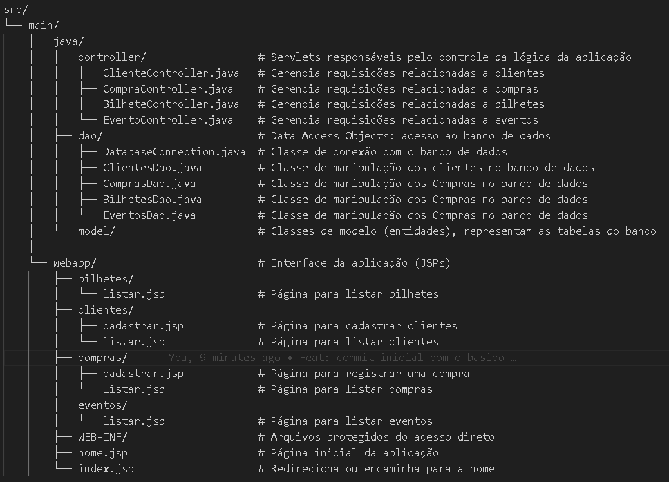
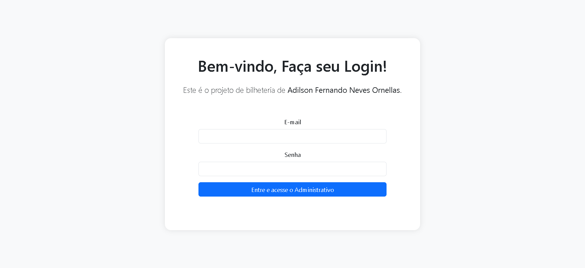
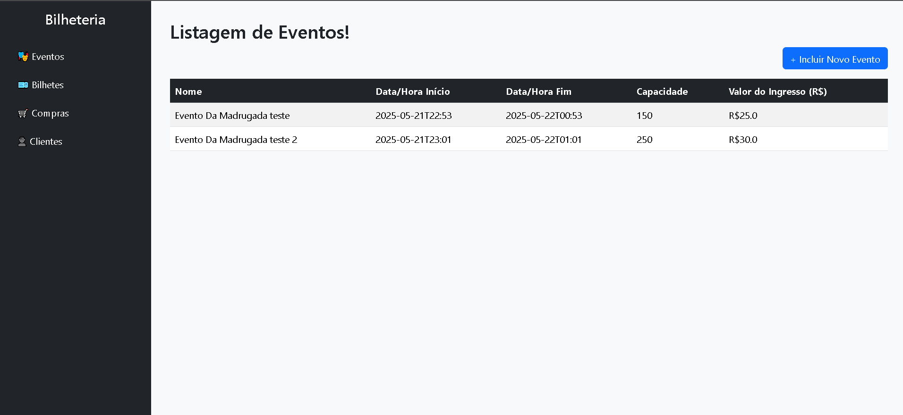
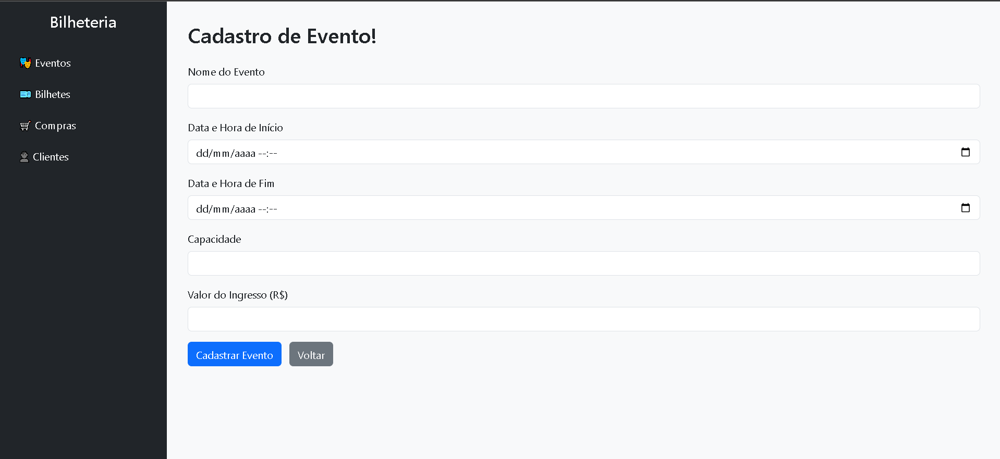
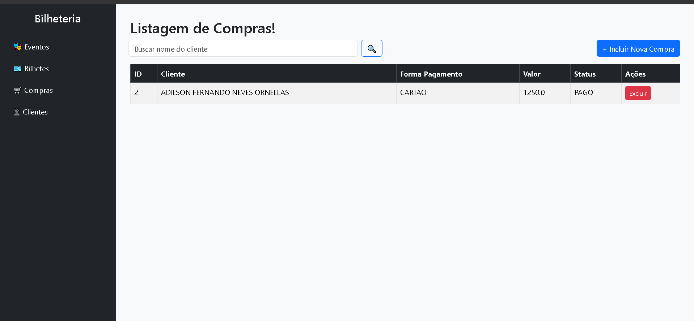
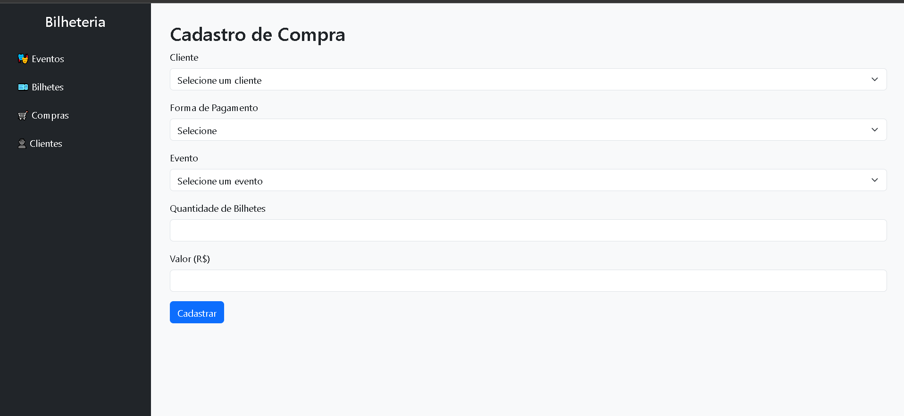
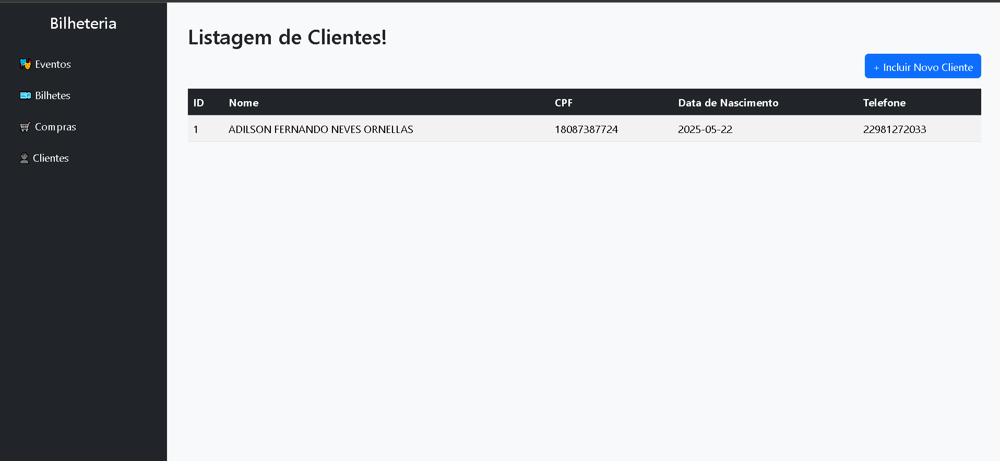
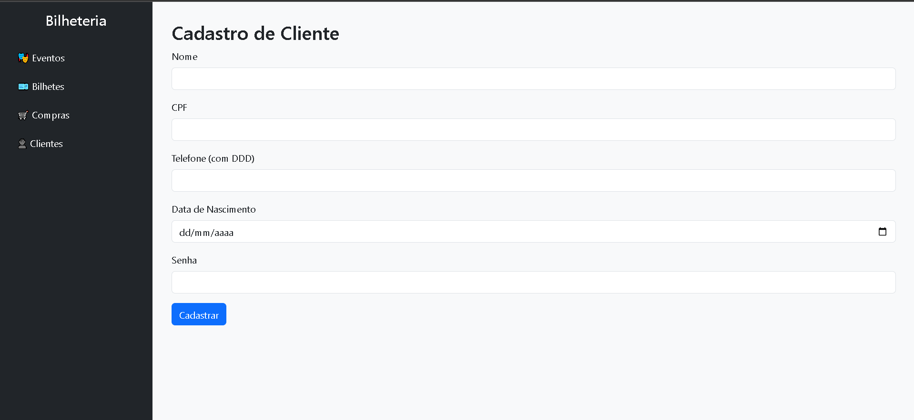
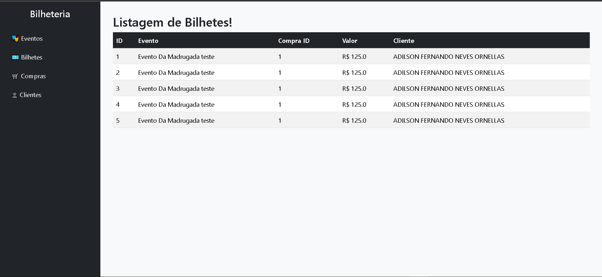

# 🎟️ Projeto Bilheteria Adilson Fernando Neves Ornellas

Sistema web simples de bilheteria desenvolvido em Java usando MVC com JSP, Servlets e DAO.  
Projeto realizado para a disciplina **Programação de Aplicações Corporativas**.

## 📁 Estrutura do Projeto

## 📌 Funcionalidades

- ✅ Gerenciamento de Bilhetes (Somente o listar)
- ✅ Gerenciamento de Eventos (Somente o listar e Incluir)
- ✅ Gerenciamento de Clientes (Somente o listar e Incluir)
- ✅ Gerenciamento de Compras (Somente listar, listar com busca, Incluir e exclusão)
- 🎨 Interface responsiva com Bootstrap 5

## 🚀 Requisitos para rodar o projeto

- Windows 7 ou superior  
- JDK 21  
- Maven 3.9.9  
- Apache Tomcat 10.1.39  
- MySQL (via XAMPP recomendado)

## ⚙️ Como executar localmente

1. Crie o banco de dados MySQL chamado `bilheteria`.
2. Importe o arquivo localizado em `docs/database.sql` para criar as tabelas.
3. Se necessario, vá no arquivo localizado em `src/main/dao/DatabaseConnection.java` e mude as configurações de conexão com banco de dados. 
4. Edite o arquivo `deploy.bat`: na linha 11, substitua o caminho `C:\dev\apache-tomcat-10.1.39` pelo caminho da sua instalação do Tomcat.  
5. Abra o terminal na pasta do projeto.  
6. Execute: "./deploy.bat"

## ▶️ Caso não queira executar o projeto localmente, você pode conferir imagens do sistema em funcionamento:

